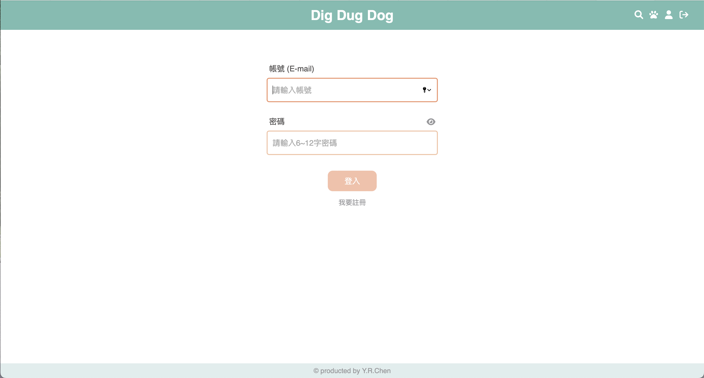
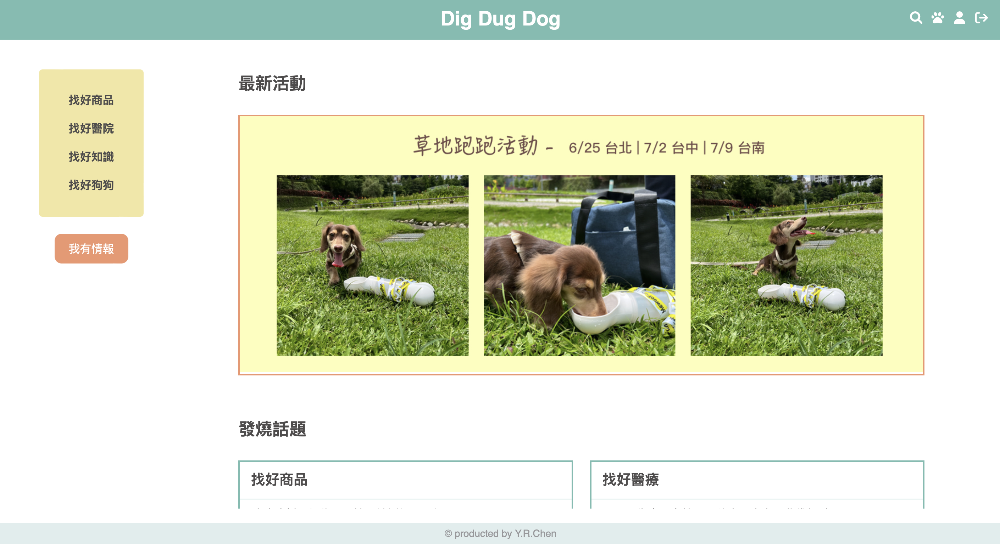

# dig-dug-dog
### A dog related information forum

</br>

## Introduction
### Website here → https://zoe19940213.github.io/dig-dug-dog/#/login
It's a forum that users can exchange dog related information. </br>
Users can review, post, reply, like any topic and get points.<>




</br>

## Project setup
### Download project 
```
git clone https://github.com/zoe19940213/dig-dug-dog.git
```
```
cd dig-dug-dog
```
```
npm install
```

### Run project
```
npm run serve
```


## Develop Environment
### Main
- vue v3.2.13
- vue-router v4.0.16
- vuex v4.0.2
- sass v1.52.3
### Tools
- sweetalert2 v11.4.18
- fontawesome v6.1.1
- uuid v8.3.2


